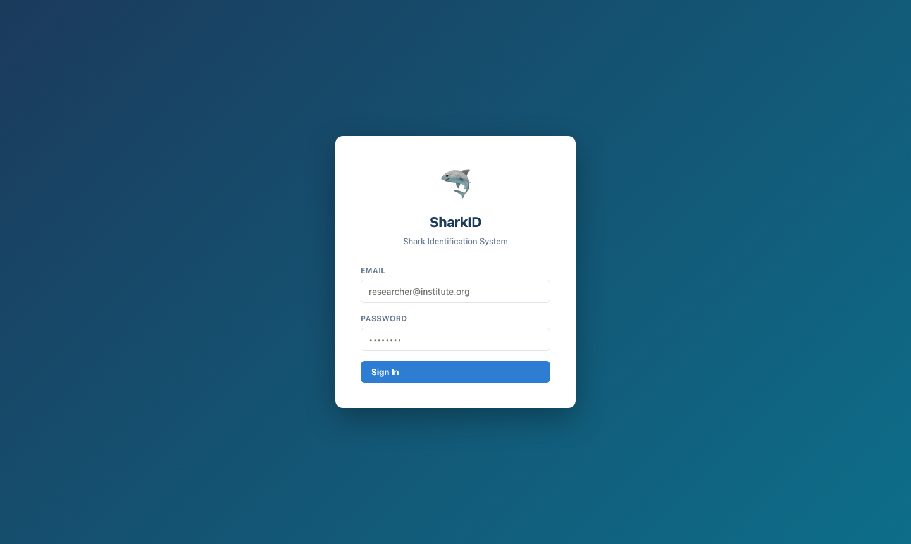
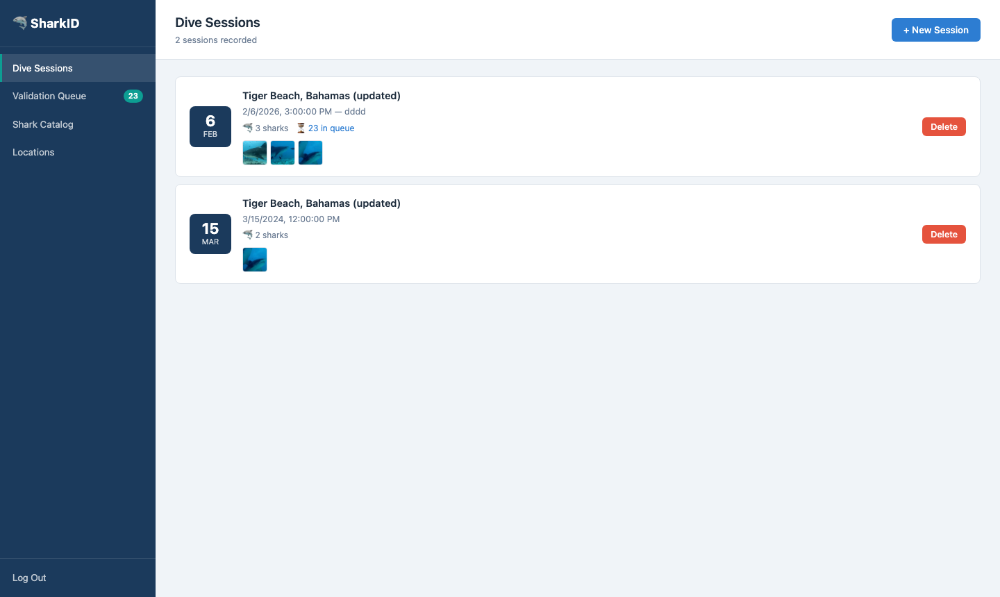
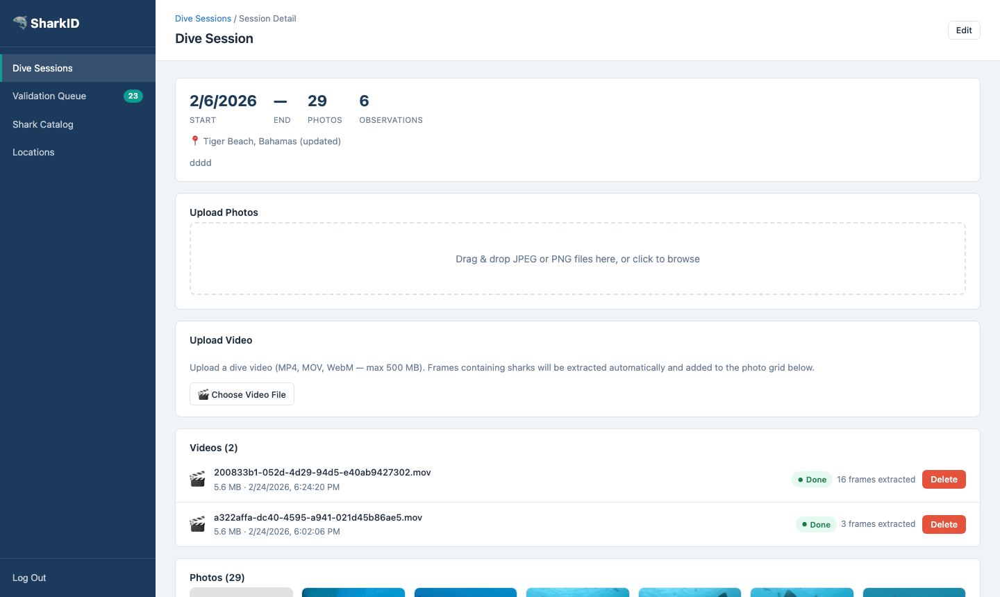
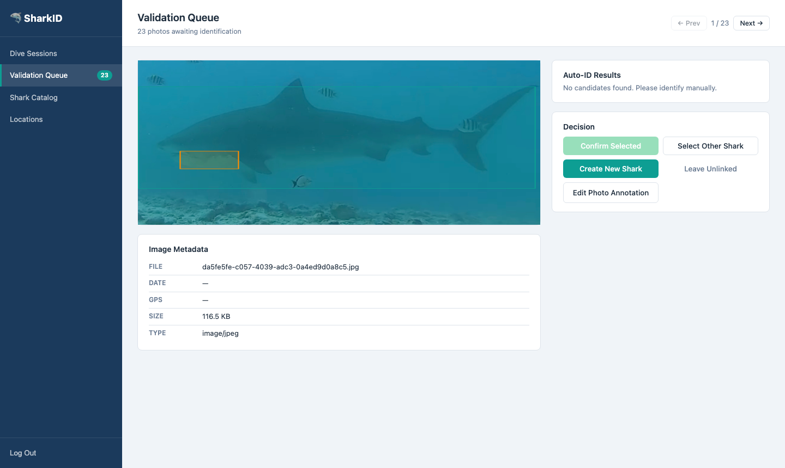
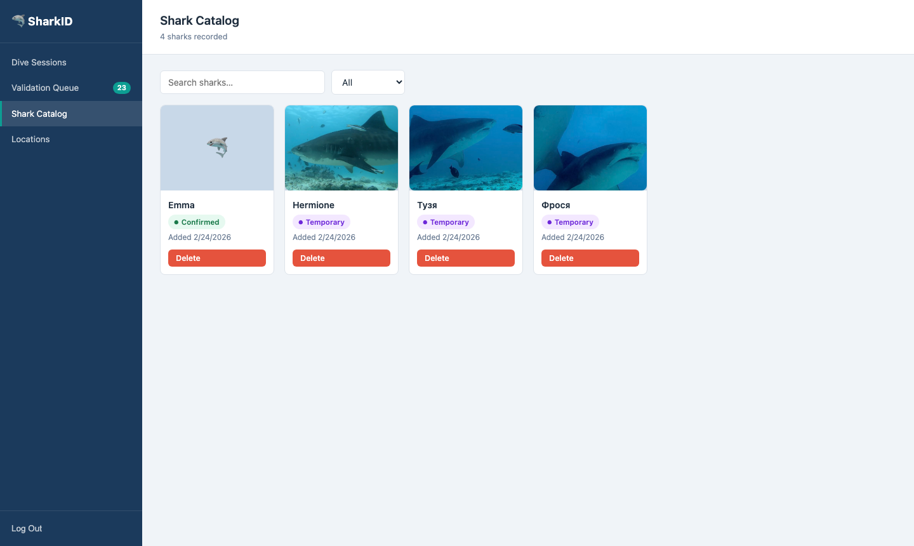

# SharkID

Tiger shark biometric identification and observation tracking system.
Researchers upload underwater photos; the system auto-detects the shark,
generates embeddings from the snout region, and matches against known individuals.
All ML suggestions require manual confirmation before they are persisted.

---

## Screenshots

| | |
|:---:|:---:|
|  |  |
| *Login* | *Dive sessions with photo thumbnails and queue counts* |
|  |  |
| *Session detail — photo grid, video upload, stats* | *Validation queue — ML annotation overlay and decision panel* |
|  |  |
| *Shark catalog with profile photos and name status* | *Shark profile — sighting stats and observation history* |

---

## Quick start

```bash
cp .env.example .env          # edit secrets if needed
docker-compose up -d
```

The app is available at **http://localhost** once all containers are healthy.

Interactive API docs: **http://localhost:8000/docs**

---

## Services

| Service | URL | Notes |
|---------|-----|-------|
| Web app | http://localhost | nginx entry point |
| Backend API | http://localhost/api/ | proxied by nginx |
| Backend (direct) | http://localhost:8000 | localhost only |
| ML service | http://localhost:8001 | localhost only |
| MinIO console | http://localhost:9001 | S3-compatible storage |
| PostgreSQL | localhost:5433 | host port (5432 may be taken) |

---

## Environment variables (`.env`)

| Variable | Description |
|----------|-------------|
| `POSTGRES_DB / USER / PASSWORD` | Database credentials |
| `MINIO_ROOT_USER / PASSWORD` | MinIO credentials |
| `MINIO_BUCKET` | Bucket name (default: `sharks-photos`) |
| `JWT_SECRET` | Secret for signing JWT tokens |
| `JWT_EXPIRY_HOURS` | Token lifetime in hours |
| `PHOTO_BASE_URL` | Public base URL for photos (`http://localhost/photos`) |
| `ML_CONFIDENCE_THRESHOLD` | Minimum cosine score for a candidate (default: `0.5`) |
| `VIDEO_FRAME_INTERVAL` | Seconds between sampled video frames (default: `0.5`) |
| `BACKEND_PORT` | Host port for direct backend access (default: `8000`) |
| `ML_PORT` | Host port for direct ML access (default: `8001`) |

---

## User management

Users are managed through the **internal API** — accessible only from
`localhost` or from within the Docker network. It is intentionally not
proxied through nginx and the backend port is bound to `127.0.0.1` only.

Base URL: `http://localhost:8000/internal/users`

### List users
```bash
curl http://localhost:8000/internal/users
```

### Create user
```bash
curl -X POST http://localhost:8000/internal/users \
  -H "Content-Type: application/json" \
  -d '{"email": "researcher@example.com", "password": "s3cr3t"}'
```

### Get user by ID
```bash
curl http://localhost:8000/internal/users/<uuid>
```

### Update user (email and/or password)
```bash
curl -X PUT http://localhost:8000/internal/users/<uuid> \
  -H "Content-Type: application/json" \
  -d '{"email": "new@example.com", "password": "newpass"}'
```

### Delete user
```bash
curl -X DELETE http://localhost:8000/internal/users/<uuid>
```

> Requests from external IPs are rejected with HTTP 403 regardless of the
> port binding. Allowed source ranges: `127.0.0.0/8`, `10.0.0.0/8`,
> `172.16.0.0/12`, `192.168.0.0/16`.

---

## Common operations

### Run database migrations
```bash
docker-compose exec backend alembic upgrade head
```

### Create a new migration
```bash
docker-compose exec backend alembic revision --autogenerate -m "description"
```

### Rebuild ML embeddings after data loss
The embedding store lives in `ml/data/` (`.npy` + `.json` files, gitignored).
If lost, re-validate photos from the Validation Queue — each confirmed photo
with *Set as profile photo* checked will re-push its embedding.

### Rebuild a single service
```bash
docker-compose up -d --build backend   # then nginx restarts automatically
```

### View logs
```bash
docker-compose logs -f backend
docker-compose logs -f ml
docker-compose logs -f nginx
```

---

## Application workflow

1. **Create a dive session** — optionally attach a location and time range.
2. **Upload photos or a video** — JPEG/PNG up to 50 MB; MP4/MOV/WebM up to 500 MB.
3. **ML pipeline runs automatically:**
   - Detects the shark body region and identification zone.
   - Generates a 106-dimensional embedding from the snout area.
   - Returns the top-5 matching candidates with confidence scores.
4. **Validation queue** — review each photo, then:
   - Confirm the top candidate, select a different shark, create a new shark, or leave unlinked.
   - Confirming with *Set as profile photo* stores the embedding for future matches.
5. **Observations** — automatically created as drafts when a shark is linked; edit and confirm to lock.
6. **Shark catalog** — browse identified individuals, view sighting history, set the main profile photo.

---

## Tech stack

| Layer | Technology |
|-------|-----------|
| Frontend | React 19, Vite 7, TypeScript 5.9 |
| Backend | Python 3.13, FastAPI, SQLAlchemy 2, Alembic |
| ML service | Python 3.13, FastAPI, Pillow, NumPy, OpenCV |
| Database | PostgreSQL 16 |
| Storage | MinIO (S3-compatible) |
| Reverse proxy | nginx (port 80) |
| Auth | JWT (Bearer token) |
